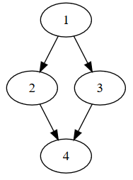

Control Flow Analysis
=====================

What are Control Flow Graphs?
-----------------------------

A control flow graph (CFG) is a graph where each node corresponds to one basic block of code, and each edge represents a possible control flow transfer. This way, a control flow graph tries to encode all possible execution paths in a chunk of code, method or entire program.

The figure below depicts a control flow graph of a very simple if-statement:

How are they modelled in Echo?
------------------------------

CFGs are modelled in Echo using the classes found in the `Echo.ControlFlow` namespace. The base interfaces include:
- `INode`: A single node.
- `IEdge`: An edge between two nodes.
- `IGraph`: A collection of nodes and edges, with one node selected as the entrypoint.

A default implementation is given to represent nodes containing a list of instructions. Given a type `TInstruction`, one could use the following classes to model a CFG:
- `Node<TInstruction>`
- `Edge<TInstruction>`
- `Graph<TInstruction>`

Constructing CFGs
-----------------

Echo supports constructing control flow graphs from chunks of code for a variety of platforms, provided that these platforms implement just a couple of interfaces.

- [Static CFG construction](StaticCfg.md)

Analysis of CFGs
----------------

Echo implements various standard analysis algorithms that can be used to effectively analyse a constructed CFG:

- [Traversal of Control Flow Graphs](Traversals.md)
- [Dominator Analysis](Dominators.md)

Exporting CFGs
--------------

Echo also has the capability to export CFGs:

- [Exporting CFGs to Dot files](Dot.md)