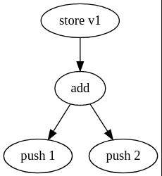

The Basics
==========

What are Data Flow Graphs?
--------------------------

Data flow graphs are graphs that encode the dependencies between objects, instructions or components. They can be used to do dependency analysis, or 

Consider the following excerpt of a function written in a fictional stack-based language:

.. code-block:: csharp

    push 1
    push 2
    add
    store v1

From the example above, we can see that two constants are pushed onto the stack, then an addition is applied, and the result is stored into ``v1``.

A data flow graph would model this as the following:

In the graph, every outgoing edge node encodes a data dependency to another node.

Data Flow Graph Models
----------------------

There are three main classes that are used to model DFGs. Given a ``TContents`` type, representing the type of data to store in each node of the DFG, Echo defines the following classes:

- ``DataFlowNode<TContents>``: A single node, wrapping an .
- ``DataDependency<TContents>``: A data dependency between two objects.
- ``DataFlowGraph<TContents>``: A collection of nodes and their dependencies.

These classes implement the ``INode``, ``IEdge`` and ``IGraph`` interfaces, and work therefore with all kinds of generic graph algorithms and export features.

Data flow nodes 
---------------

Nodes expose their direct dependencies using the following properties:

- ``StackDependencies``: A collection of stack slots that the node depends on.
- ``VariableDependencies``: A collection of variables the node depends on.

These properties are collections of type ``DataDependency<TContents>`` and are fully mutable, and can be used to add or remove dependencies between nodes. Every ``DataDependency<TContents>`` represents a single value with potentially multiple data sources. As a result, every stack value that an instruction pops is assigned exactly one ``DataDependency<TContents>`` in the ``StackDependencies`` property. 

Simple data dependencies
-------------------------

Taking the example on the top of this article, the ``store v1`` instruction would have one single data dependency with one data source to the ``add`` instruction, and the ``add`` instruction would have two data dependencies with both one data source to the ``push 1`` and ``push 2`` instructions respectively.

Below an example snippet that obtains the dependency instructions of the ``add`` instruction.

.. code-block:: csharp

    DataFlowGraph<T> dfg = ...
    DataFlowNode<T> add = dfg.GetNodeById(...);  

    // Obtain the symbolic values that are popped by the instruction.
    var dependency1 = add.StackDependencies[0];
    var dependency2 = add.StackDependencies[1];
    
    // Get the instructions responsible for pushing the values 
    var argument1 = dependency1.DataSources.First().Contents; // returns "push 1"
    var argument2 = dependency2.DataSources.First().Contents; // returns "push 2"

To speed up the process, Echo defines an extension methods that obtains all of the dependency data flow nodes, and sorts them in such a way that they can be evaluated in order.

.. code-block:: csharp

    DataFlowGraph<T> dfg = ...
    DataFlowNode<T> add = dfg.GetNodeById(...);  

    var dependencies = add.GetOrderedDependencies(); // returns {"push 1", "push 2"}

Multiple data sources
----------------------

It is important to note that a single data dependency might have multiple data sources (i.e. where the value might come from).

For example, if we change the example slightly to the following control flow graph:

.. image:: img/if.png
    :alt: An if statement.

The value that is popped by the ``store v1`` instruction has two possible values, and therefore two different data sources. In Echo, this would be encoded as a single ``DataDependency<TContents>`` with two possible data sources ``push 1`` and ``push 2``. 

Below an example on how to find the direct dependencies of the ``store v1`` node:

.. code-block:: csharp

    DataFlowGraph<T> dfg = ...
    DataFlowNode<T> storeV1 = dfg.GetNodeById(...);  

    // Obtain the symbolic value that is popped by the instruction.
    var dependency = storeV1.StackDependencies[0];

    // Print out the possible data sources for this value:
    foreach (DataFlowNode<T> sourceNode in dependency.DataSources)
        Console.WriteLine(sourceNode.Contents);

