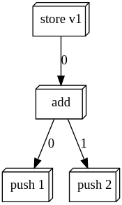
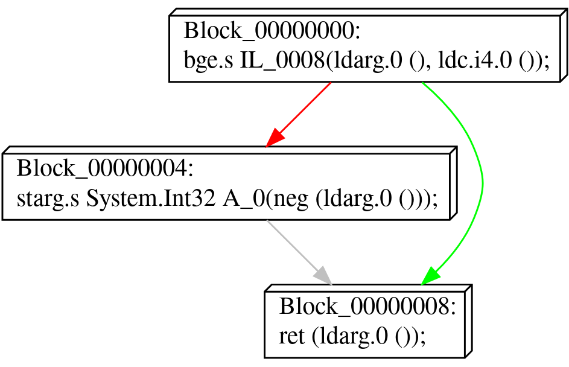
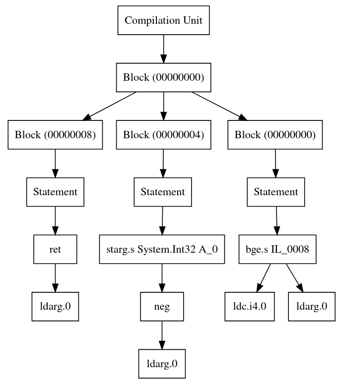

# Abstract Syntax Trees (AST)

An abstract syntax trees (AST) is a tree-like data structure that represents code in a syntactical structure.
They are powerful because they encode both control flow and data dependency, and can be modified easily without risking to break other surrounding code in a function body.
Therefore, abstract syntax trees are used in various types of program analysis and program transformation systems, such as (de)compilation and (de)obfuscation of code.

<div style="text-align:center">
    
</div>


## Construction

To construct an AST usingv Echo's built-in AST builder, you will first need a control flow graph (see [Graph Construction](cfg-construction.md)).
Then, a `IPurityClassifier<TInstruction>` is required that is able to infer whether instructions may produce side-effects or not.
As every instruction set is different, these are platform specific (e.g., for the CIL platform there is a `CilPurityClassifier` class).

Using the classifier, it is possible to lift the control flow graph into a new control flow graph consisting of blocks that contain expression trees as opposed to individual instructions.

```csharp
using Echo.Ast.Construction;

ControlFlowGraph<TInstruction> cfg = ...;
IPurityClassifier<TInstruction> classifier = ...;

var liftedCfg = cfg.Lift(classifier);
```

This turns a control flow graph that looks like:

<div style="text-align:center">
    
</div>

into a graph that looks like:

<div style="text-align:center">
    
</div>


To create a single rooted AST that represents the entire function body as a single syntactical tree structure, we can lift the AST control flow graph into a single compilation unit using the `ToCompilationUnit` extension method:

```csharp
var root = liftedCfg.ToCompilationUnit();
```

This creates a structure that looks like the following:

<div style="text-align:center">
    
</div>

Or in textual form:

```
{
    {
        bge.s IL_0008(ldarg.0(), ldc.i4.0());
    }
    {
        starg.s System.Int32 A_0(neg(ldarg.0()));
    }
    {
        ret(ldarg.0());
    }
}
```

## AST Node Types

Echo distinguishes between statements and expressions in the AST.
Statements are individual nodes that make up blocks of code executed in sequence.
Expressions are individual building blocks that make up statements.

The following statement types are available:

| Type                        | Description                                          | Example                     |
|:----------------------------|:-----------------------------------------------------|:----------------------------|
| `ExpressionStatement`       | An expression wrapped into a statement.              | `op(a, b);`                 |
| `AssignmentStatement`       | An assignment of a value to one or more variables.   | `x, y = op(...);`           |
| `PhiStatement`              | A statement merging multiple SSA variables into one. | `x = φ(v1, v2)`             |
| `BlockStatement`            | A scope block consisting of one or more statements.  | `{ op1(); op2(); ... }`                   |
| `ExceptionHandlerStatement` | An exception handler block.                          | `try { ... } catch { ... }` |

The following expression types are available:

| Type                    | Description                                 | Example     |
|:------------------------|:--------------------------------------------|:------------|
| `InstructionExpression` | An instruction with zero or more arguments. | `op(a, b)`  |
| `VariableExpression`    | A reference to a variable                   | `x`         |

The root of every AST is represented by a `CompilationUnit`.
It exposes the root scope of the code, and is neither a statement nor an expression and thus cannot be added to any other statement or other compilation unit.


## Traversing AST Nodes

The AST API implements the visitor pattern. 
Once a `CompilationUnit<TInstruction>` is constructed, it can be traversed using the `IAstVisitor<TInstruction>` or `IAstListener<TInstruction>` interface, which defines methods for each type of node that might appear in an AST.

```csharp
class MyListener : AstNodeListener<TInstruction>
{
    public virtual void EnterBlockStatement(BlockStatement<TInstruction> statement) 
    {
        Console.WriteLine("Entering scope...");
    }

    public virtual void ExitBlockStatement(BlockStatement<TInstruction> statement) 
    {
        Console.WriteLine("Leaving scope...");
    }
    
    public virtual void EnterInstructionExpression(InstructionExpression<TInstruction> expression) 
    {
        Console.WriteLine($"Entering {expression}...");
    }
    
    public virtual void ExitInstructionExpression(InstructionExpression<TInstruction> expression) 
    {
        Console.WriteLine($"Exiting {expression}...");
    }

    /* ... */
}
```

An `AstNodeWalker` could then be used in conjuction with such a listener to fully traverse the AST and operate:

```csharp
CompilationUnit<TInstruction> root = ...;
AstNodeWalker.Walk(new MyListener(), root);
```


## Cross-Referencing Variables

The AST keeps track of all reads and writes to variables.
This can be used to cross-referenced a variable and see where it is being used and/or written in a function body.

The following code iterates over all expressions that use a variable, and all statements that write to it.

```csharp
CompilationUnit<TInstruction> root = ...;
VariableExpression<TInstruction> expression = ...;

foreach (var use in expression.Variable.GetIsUsedBy(root))
{
    Console.WriteLine($"Variable {expression.Variable.Name} is used in '{use.Parent}'");
}

foreach (var definition in expression.Variable.GetIsWrittenBy(root))
{
    Console.WriteLine($"Variable {expression.Variable.Name} is written by '{definition}'");
}
```

> [!NOTE]
> When updating the AST, the cross-references are automatically updated in the AST as well.