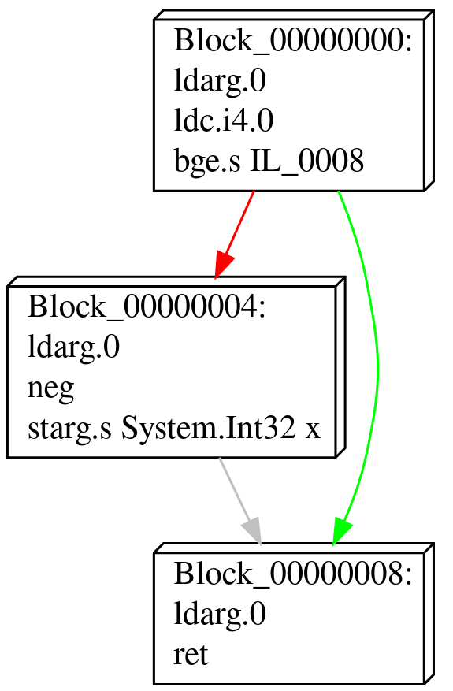
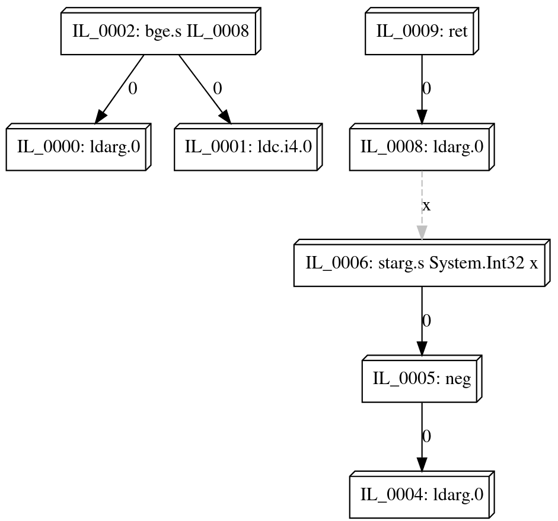

# Data Flow Graphs (DFG)

Data flow graphs are graphs that encode the dependencies between objects, instructions or components.
Where an edge in a control flow graph encodes a possible execution paths a program could take:

<div style="text-align:center"> 
    
</div>

an edge in a data flow graph' points to an instruction the node depends on:

<div style="text-align:center"> 
    
</div>


## Graphs

Every data flow graph is represented using the `DataFlowGraph<TInstruction>` class.

A new, empty graph can be created by using one of the constructors.

```csharp
var dfg = new DataFlowGraph<TInstruction>();
```

To extract a data flow graph from an existing code stream, refer to [Symbolic Graph Construction](cfg-construction.md#symbolic-graph-construction).


## Nodes

Nodes in a data flow graph represent the individual components in the code that can introduce dependencies, and are implemented by the `DataFlowNode<TInstruction>` class.
They can be accessed from the `Nodes` property:

```csharp
DataFlowGraph<TInstruction> dfg = ...;

// Iterate over all nodes in a data flow graph:
foreach (var node in dfg.Nodes)
    Console.WriteLine(node.Contents);
```

Nodes are indexed by offset.
They can be obtained via the `GetNodeById` method:

```csharp
var node = dfg.GetNodeById(id: 0x1234);
```

Every node exposes a basic blockc containing the instructions that introduces or requires dependencies:

```csharp
DataFlowNode<TInstruction> node = ...;
var instruction = node.Contents;
```


## Edges

Nodes are connected to each other with edges, represented by instances of the `DataDependency` class.

There are two types of data dependencies Echo distinguishes:

| Type                 | Description                                                                    |
|----------------------|--------------------------------------------------------------------------------|
| `StackDependency`    | The instruction depends on a value pushed by another instruction on the stack. |
| `VariableDependency` | The instruction depends on a value set to a variable by another instruction.   |


Individual dependenc can be obtained by accessing their respective properties.
For example, the instructions that push values a node depends on can be obtained by querying the `StackDependencies` property:

```csharp
DataFlowNode<TInstruction> node = ...;

// Iterate all stack dependencies.
for (int i = 0; i < node.StackDependencies.Count; i++)
{
    // Every dependency can have multiple possible data sources.
    Console.WriteLine($"Stack value {i}");
    foreach (var dataSource in dependency)
        Console.WriteLine($"- Value {dataSource.SlotIndex} of {dataSource.Node}.");
}
```

Similarly, instructions that assign a value to a variable which the node depends on can be obtained by the `VariableDependencies` property:

```csharp
DataFlowNode<TInstruction> node = ...;

foreach (var dependency in node.VariableDependencies)
{
    Console.WriteLine(dependency.Variable);
    foreach (var dataSource in dependency)
        Console.WriteLine($" - {dataSource.Node}");
}
```

Echo defines an extension methods that recursively traverses the DFG and obtains all instructions that an instruction depends on.

```csharp
DataFlowGraph<TInstruction> node = ...
var dependencies = node.GetOrderedDependencies();
```

By default, `GetOrderedDependencies` traverses all edges in the data flow graph.
This includes variable dependencies that were registered in the graph.
If only the stack dependnecies are meant to be traversed (e.g. to get the instructions that make up a single expression), additional flags can be specified to alter the behaviour of the traversal.

```csharp
DataFlowGraph<TInstruction> node = ...
var dependencies = add.GetOrderedDependencies(DependencyCollectionFlags.IncludeStackDependencies);
```

> [!WARNING]
> When a data dependency has multiple data sources, `GetOrderedDependencies` will only choose one. 
> The method is defined to find one sequence of instructions that produce the values of the dependencies, not all possible sequences of instructions.
> It is undefined which sequence is picked.


## Visualizations

Echo provides default serializers for graphs in DOT format.

```csharp
using var writer = File.CreateText("output.dot");
cfg.ToDotGraph(writer);
```

These can then be visualized using e.g., [GraphViz](https://dreampuf.github.io/GraphvizOnline/).